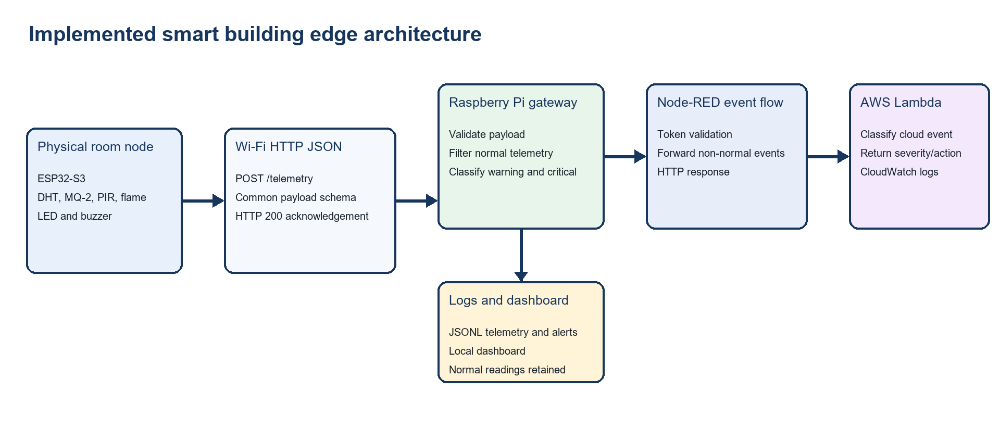
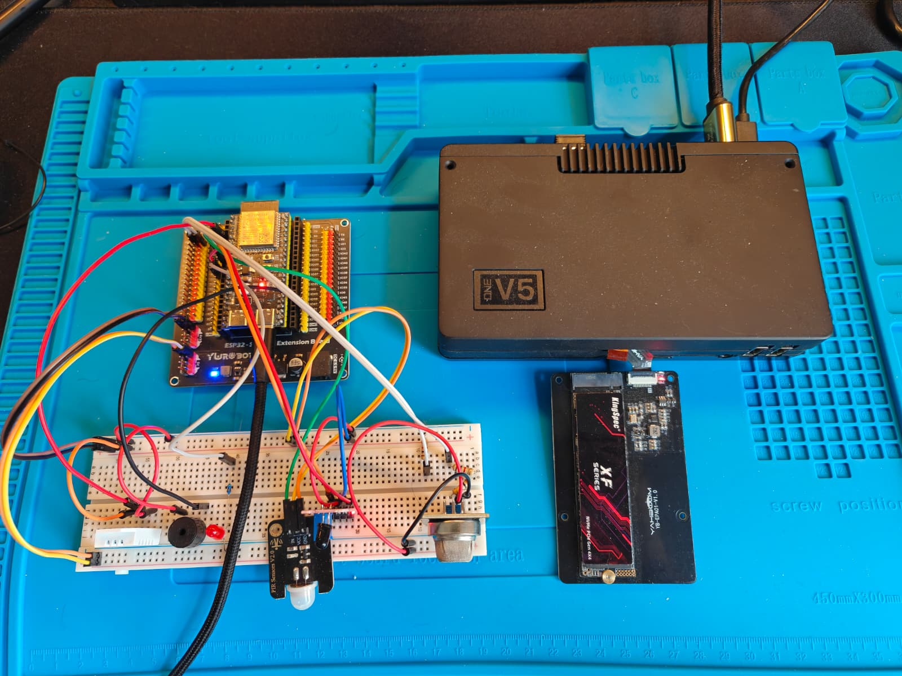

# Smart Building Edge Monitoring

> A physical ESP32-S3 smart-building node, Raspberry Pi edge gateway, Node-RED event microservice, and AWS Lambda integration for scalable IoT monitoring.



## Why this project

Cloud-first telemetry can create unnecessary network and processing load when most readings are routine. This project classifies data at the edge, keeps normal telemetry local, and forwards only warning or critical events through an event-driven cloud route.

**SIT314 Software Architecture and Scalability for IoT - 6.3D Final Project**

## Highlights

- Physical ESP32-S3 node using DHT22, MQ-2, PIR, flame sensor, LED, and buzzer
- Raspberry Pi Node.js gateway with `POST /telemetry`, JSONL persistence, and a live dashboard
- Readiness-aware MQ-2 baseline and absolute-delta alert rules
- Node-RED event route for non-normal readings, authenticated with an edge token
- AWS Lambda classifier deployed in the AWS Academy Learner Lab
- Authentication at both event boundaries: device token for ESP32-to-Pi and edge token for Pi-to-cloud
- Repeatable offline and live load testing with the same telemetry schema

## Architecture

```text
ESP32-S3 sensors
  -> authenticated HTTP telemetry
  -> Raspberry Pi Node.js gateway
  -> local filtering, dashboard and JSONL logs
  -> Node-RED event route for warning / critical readings
  -> AWS Lambda classifier and CloudWatch runtime logs
```

Normal readings remain at the Pi. Warning and critical readings are forwarded asynchronously to preserve the edge-first design.

## Prototype



## Repository layout

| Path | Purpose |
| --- | --- |
| `esp32_s3_final_node/` | Arduino sketch for the physical ESP32-S3 sensor node |
| `edge_gateway/` | Node.js edge API, rule engine, dashboard, and JSONL logging |
| `node_red/` | Importable Node-RED event flow |
| `aws/lambda/` | AWS Lambda classifier |
| `simulation/` | Virtual-node load simulator using the physical node schema |
| `docs/images/` | Architecture and prototype visuals |

## Security model

The ESP32 includes `X-Device-Token` in telemetry requests. The Pi rejects requests without a valid token with HTTP 401. For non-normal events, the Pi adds `X-Edge-Token` when forwarding to Node-RED; Node-RED validates it before invoking Lambda.

These controls demonstrate application-layer authentication. The deployment remains a teaching prototype: the local device-to-Pi hop is HTTP, so a production implementation should add per-device credentials, rotating secrets, and HTTPS or MQTT over TLS.

## Quick start

### 1. Configure the ESP32

Copy the safe template and set your local values. `private_config.h` is ignored by Git.

```text
esp32_s3_final_node/private_config.h.example
  -> esp32_s3_final_node/private_config.h
```

Configure Wi-Fi, the Pi telemetry URL, and a device token that matches the Pi environment. Upload `esp32_s3_final_node.ino` using Arduino IDE, then open Serial Monitor at `115200` baud.

### 2. Start the edge gateway

```bash
cd edge_gateway
export DEVICE_SHARED_TOKEN="your-device-token"
export EDGE_SHARED_TOKEN="your-edge-token"
export NODE_RED_EVENT_URL="http://127.0.0.1:1880/edge-events"
node edge_server.js
```

The dashboard is available at `http://<pi-ip>:3000/`.

### 3. Deploy Node-RED and Lambda

Import `node_red/smart_building_edge_flow.json` into Node-RED. Configure its runtime environment for the edge token and Lambda Function URL, then deploy. The Lambda implementation is in `aws/lambda/index.mjs`.

## Scalability tests

Run the offline capacity model:

```bash
python simulation/simulate_edge_load.py
```

Run a live authenticated test against the Pi:

```bash
python simulation/simulate_edge_load.py \
  --post-url http://<pi-ip>:3000/telemetry \
  --device-token "your-device-token" \
  --nodes 25 --steps 10 --concurrency 10
```

The final evaluation reports the offline model separately from live Pi HTTP timing. The model explores 8 to 400 virtual nodes; live staged runs measured 1,830 successful POSTs, and a concurrent check measured 250 successful POSTs.

## Evidence and limitations

The implementation was validated with physical serial telemetry, accepted HTTP 200 acknowledgements, rejected HTTP 401 unauthorised requests, Pi dashboard forwarding counters, deployed Node-RED/Lambda integration, CloudWatch runtime logs, and repeatable simulation output.

MQ-2 data is treated as a gas-risk proxy, not a calibrated air-quality measurement. This is not a production safety system and would require calibrated/redundant sensing and formal safety review.

## Technology

`ESP32-S3` `Arduino` `Node.js` `Node-RED` `AWS Lambda` `CloudWatch` `Python` `Raspberry Pi` `HTTP` `JSONL`

## Author

Kin Ho Fung - SIT314 final project submission.
